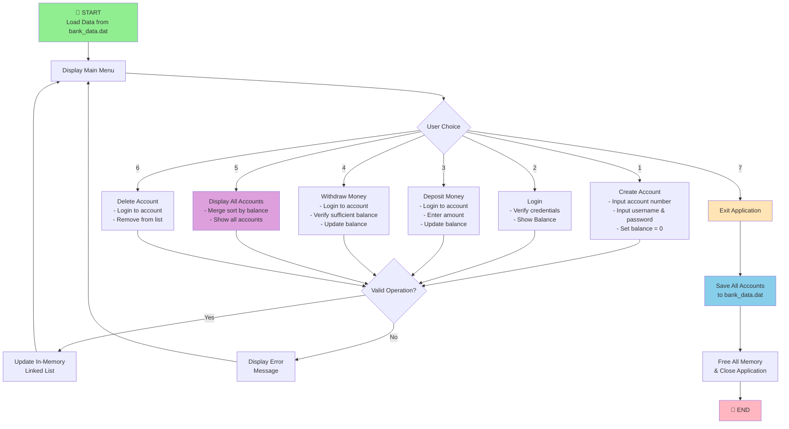

# 🏦 Bank Management System

A console-based bank management application written in **C**, using a **linked-list** data structure for in-memory account storage, **djb2 password hashing** for credential security, and **binary file** persistence on disk.

---

## 📋 Table of Contents

- [Overview](#overview)
- [Features](#features)
- [Project Structure](#project-structure)
- [Data Model](#data-model)
- [Application Flow](#application-flow)
- [Getting Started](#getting-started)
  - [Prerequisites](#prerequisites)
  - [Build](#build)
  - [Run](#run)
  - [Clean](#clean)
- [Usage](#usage)
- [Data Persistence](#data-persistence)
- [Security](#security)
- [Tech Stack](#tech-stack)
- [Code Documentation](#code-documentation)
- [Limitations](#limitations)
- [License](#license)

---

## Overview

The system loads account records from `bank_data.dat` into a singly linked list at startup. All operations — account creation, login, deposits, withdrawals, and display — are performed on the in-memory list. When the user exits, every record is written back to the binary file and all allocated memory is freed.

---

## Features

| # | Feature | Description |
|---|---------|-------------|
| 1 | **Create Account** | Register a new account with a unique account number, username, and password |
| 2 | **Check Balance** | Log in with credentials to view the current balance |
| 3 | **Deposit Money** | Add funds to an account after credential verification |
| 4 | **Withdraw Money** | Withdraw funds with insufficient-balance validation |
| 5 | **Display All Accounts** | View every account sorted by balance (ascending) using merge sort |
| 6 | **Delete Account** | Remove an account after credential verification |
| 7 | **Data Persistence** | Automatically save and load accounts from a binary file between sessions |
| 8 | **Password Hashing** | Passwords are hashed using the djb2 algorithm before storage — plaintext passwords are never saved |

---

## Project Structure

```
bank-system/
├── Makefile            # Build automation
├── README.md
├── .gitignore
├── include/
│   └── bank.h          # Header — structs & function declarations
├── src/
│   ├── main.c          # Entry point & menu loop
│   └── bank.c          # Core logic (CRUD, sorting, file I/O)
├── bin/                # Compiled binary output (git-ignored)
└── build/              # Intermediate build files (git-ignored)
```

---

## Data Model

```c
struct Account {
    int account_number;
    char username[50];
    char password[50];    /* Stored as a djb2 hex hash, never plaintext */
    int balance;
};
```

Accounts are stored in a **singly linked list** (`struct Node`) for dynamic, heap-based management.

---

## Application Flow



---

## Getting Started

### Prerequisites

- **GCC** (MinGW on Windows, or any standard C compiler)
- **Make** (optional — you can compile manually)

### Build

**Using Make:**

```bash
make
```

This compiles `src/main.c` and `src/bank.c` and outputs the binary to `bin/bank_app`.

**Manual compilation (Windows):**

```bash
gcc -Wall src/main.c src/bank.c -o bin/bank_app.exe
```

### Run

**PowerShell / CMD:**

```powershell
.\bin\bank_app.exe
```

**Git Bash / Linux / macOS:**

```bash
./bin/bank_app
```

### Clean

```bash
make clean
```

---

## Usage

On launch you'll see the interactive menu:

```
=== Bank Management System ===
1. Create Account
2. Check Balance
3. Deposit Money
4. Withdraw Money
5. Display All Accounts
6. Delete Account
7. Exit
Choose an option:
```

Select an option by entering its number. Follow the on-screen prompts for each operation.

---

## Data Persistence

| Event | Action |
|-------|--------|
| **Startup** | `load_data()` reads `bank_data.dat` and builds the linked list |
| **Exit (option 7)** | `save_exit()` writes all accounts back to `bank_data.dat`, frees memory, and terminates |

> The data file is created automatically on first exit if it doesn't already exist.

---

## Security

Passwords are **never stored in plaintext**. The system uses the **djb2 hash algorithm** (by Daniel J. Bernstein) to convert passwords into fixed-length hexadecimal strings before saving them to disk.

| Step | What happens |
|------|--------------|
| **Account Creation** | The user's password is hashed via `hash_password()` and only the hash is stored in the `Account` struct |
| **Login / Verification** | The entered password is hashed on the fly and compared against the stored hash |

```c
// Example: "mypass123" → "7c9e6816e7a5"
void hash_password(const char* password, char* output) {
    unsigned long hash = 5381;
    int c;
    while ((c = *password++))
        hash = ((hash << 5) + hash) + c;  // hash * 33 + c
    sprintf(output, "%lx", hash);
}
```

> **Note:** djb2 is a fast, well-distributed hash suitable for educational purposes. Production systems should use cryptographic hashes like bcrypt or Argon2.

---

## Tech Stack

- **Language:** C (C99)
- **Data Structure:** Singly Linked List
- **Sorting Algorithm:** Merge Sort (linked-list variant with fast/slow pointer split)
- **Hashing:** djb2 (password hashing with hex-encoded output)
- **File I/O:** Binary read/write (`fread` / `fwrite`)
- **Build Tool:** GNU Make

---

## Code Documentation

All source files are thoroughly documented with **Doxygen-style comments**:

| File | Documentation |
|------|---------------|
| `include/bank.h` | `@file` / `@struct` / `@brief` docstrings for every struct and function declaration, with `@param` and `@return` tags |
| `src/bank.c` | File-level overview, section dividers (Account Operations, Data Persistence, Merge Sort, Display), full function docstrings, and step-by-step inline comments |
| `src/main.c` | File-level docstring, inline comments explaining the menu loop and each case branch |

---

## Limitations

- djb2 is not a cryptographic hash — a production system should use bcrypt, scrypt, or Argon2 with salting
- Input handling assumes correct data types (no robust input validation)
- No profile-update functionality
- No transaction history or audit logging
- Single-user console application (no concurrency)

---

## License

This project is open-source and available for educational purposes.